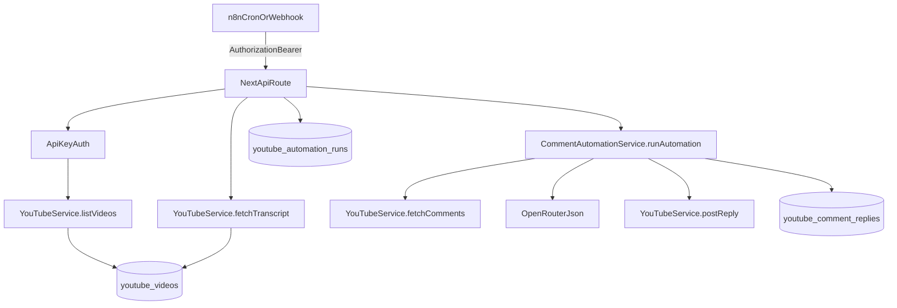

### What you can do today (no new code)
- **Pick latest video**: call `GET /api/v1/youtube/videos?maxResults=5` to get the most recent uploads (already filters to `public` + `processed`).
- **Run automation**: call `POST /api/v1/youtube/automate` with `{ "videoId": "..." }`.

**Blocker for headless automation**: `POST /api/v1/youtube/automate` requires a Supabase-authenticated user session (cookie) and the automation service currently reads transcript from `youtube_videos` (DB). Transcripts are currently fetched/inserted server-side inside the UI page `[videoId]/page.tsx`, not via an API route.

### Target behavior (your requirement)
- **From n8n**: one API call that:
  - looks at the latest N videos (e.g. 5)
  - finds which ones are **not yet in DB**
  - fetches transcript (if captions exist) + stores metadata
  - tracks stages/status (video synced → transcript fetched → automation started → replies posted/queued)
  - runs automation and (optionally) auto-posts replies.

### Design decisions (locked in)
- **Auth**: Use a dedicated per-user API key created in-app (Settings UI). n8n sends it via `Authorization: Bearer <api_key>`.

### Proposed API surface
1) **API key management**
- Add endpoints:
  - `POST /api/v1/api-keys` (create a key, return plaintext once)
  - `GET /api/v1/api-keys` (list keys, masked)
  - `DELETE /api/v1/api-keys/:id`
- Add request auth helper that accepts either:
  - existing Supabase user session (browser)
  - **or** `Authorization: Bearer <api_key>` (n8n)
- Add Settings UI:
  - New “API Keys” section where users can create/revoke keys (similar UX to the existing infra key form), show masked key + copyable prefix, and show “last used” metadata.

2) **API documentation (no custom docs UI)**
- Add **Scalar** API reference UI served by Next.js:
  - `GET /api/docs` renders interactive docs UI (Scalar)
  - Docs are generated from an **OpenAPI 3.1** spec we maintain in-code (single source of truth)
- The OpenAPI spec will include:
  - `Authorization: Bearer <api_key>` auth scheme
  - endpoint descriptions, request/response schemas, and common error envelopes
  - copy-paste **n8n** examples (headers + JSON bodies) embedded as markdown in endpoint descriptions

2) **Sync latest videos + transcripts**
- `POST /api/v1/youtube/videos/sync`
  - body: `{ maxVideos?: number = 5, fetchTranscript?: boolean = true, skipIfNoCaptions?: boolean = false }`
  - behavior:
    - call `YouTubeService.listVideos(maxVideos)`
    - for each video, upsert into `youtube_videos` (store title/thumbnail/published_at)
    - if missing transcript and `fetchTranscript`, call `YouTubeService.fetchTranscript(videoId)` then update row
    - return summary: counts + which videoIds were inserted/updated

3) **Run automation on newest unprocessed videos**
- `POST /api/v1/youtube/automate/latest`
  - body: `{ maxVideos?: number = 5, runLimit?: number = 1, requireTranscript?: boolean = false, autoPostOverride?: boolean }`
  - behavior:
    - ensure latest videos are present (optionally call the sync logic internally)
    - pick candidate video(s) where **no successful automation run exists yet**
    - run `CommentAutomationService.runAutomation(userId, videoId)`
    - persist run status and counts
    - return per-video run results

### Database additions (run tracking + API keys)
- New table `user_api_keys`:
  - `id uuid`, `user_id uuid`, `name text`, `key_hash text`, `prefix text`, `created_at`, `last_used_at`, `revoked_at`
  - store **only a hash** of the key (argon2/bcrypt), plus a short prefix for display.
- New table `youtube_automation_runs`:
  - `id uuid`, `user_id uuid`, `video_id text`, `status text` (e.g. `started|completed|failed`),
  - stage timestamps: `synced_at`, `transcript_fetched_at`, `automation_started_at`, `automation_completed_at`
  - counters: `processed`, `queued`, `posted`
  - `error_message text`
  - unique index on `(user_id, video_id)` for “latest run” semantics, or keep multiple runs with `(user_id, video_id, started_at)`.

### Implementation touchpoints (files)
- API routes
  - `src/app/api/v1/youtube/automate/route.ts` (reuse logic; accept API-key auth)
  - Add new routes:
    - `src/app/api/v1/youtube/videos/sync/route.ts`
    - `src/app/api/v1/youtube/automate/latest/route.ts`
    - `src/app/api/v1/api-keys/*` (create/list/revoke)
  - Docs route:
    - `src/app/api/docs/route.ts` (Scalar handler)
- Auth helper
  - new `src/lib/api-auth.ts` (resolve `userId` from Supabase session OR `Authorization: Bearer <api_key>`)
- OpenAPI spec (single source of truth)
  - `src/lib/openapi.ts` (exports an OpenAPI 3.1 document for Scalar)
- Services
  - `src/services/youtube/comment-automation.service.ts` (record run status + allow transcript-missing fallback by fetching transcript if desired)
- Frontend docs + UI
  - Settings UI: update `src/app/(dashboard)/settings/page.tsx` + `src/components/settings/settings-shell.tsx` to include an “API Keys” section
  - Link to `/api/docs` from Settings (and optionally from Sidebar) so users can discover the documentation.

### n8n workflow (after changes)
- Cron trigger → HTTP Request:
  - `POST /api/v1/youtube/automate/latest`
  - headers: `Authorization: Bearer <your_api_key>`
  - body: `{ "maxVideos": 5, "runLimit": 1, "autoPostOverride": true }`

### Data flow (high-level)

### Test plan
- Call new endpoints with:
  - browser session (existing)
  - `Authorization: Bearer <api_key>` (new)
- Validate:
  - latest 5 videos are synced
  - transcript is stored when captions exist
  - automation runs and writes `youtube_comment_replies`
  - auto-post path posts to YouTube and marks `posted`
  - run tracking row updates stages + counters

